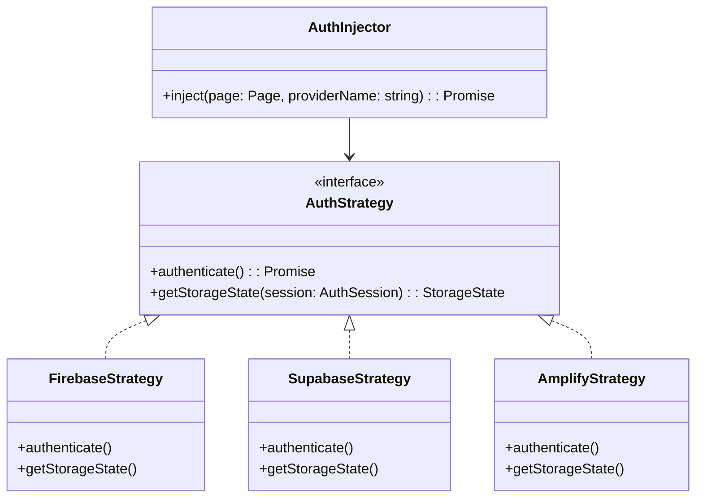

##**Playwright Auth Injector: 設計仕様書 (v0.1)**###1. プロジェクト概要* **名称:** `playwright-auth-injector`
* **目的:** Playwright E2Eテストにおける認証UI操作をスキップし、認証状態（State）をブラウザコンテキストに直接注入する。
* **コア哲学:** "Configuration over Boilerplate"（設定ファイルのみで動作し、複雑なセットアップコードを隠蔽する）。
* **ターゲット:** Firebase, Supabase, AWS Amplify (Cognito), Auth0。

###2. アーキテクチャ設計 (Strategy Pattern)拡張性を高めるため、共通インターフェース (`AuthStrategy`) を定義し、各プロバイダーをその実装クラスとして定義します。



###3. ディレクトリ構成案```text
src/
├── index.ts                # エントリーポイント
├── core/
│   ├── injector.ts         # メインロジック (AuthInjector)
│   ├── config-loader.ts    # 設定ファイル読み込み・バリデーション (Zod使用推奨)
│   └── types.ts            # 共通型定義
├── strategies/             # 各プロバイダーの実装
│   ├── base.strategy.ts    # 基底クラス
│   ├── firebase.ts         # Firebase実装
│   ├── supabase.ts         # Supabase実装
│   └── amplify.ts          # Amplify実装
└── utils/
    ├── indexed-db.ts       # IndexedDB操作ヘルパー
    └── local-storage.ts    # LocalStorage操作ヘルパー

```

###4. ユーザーインターフェース (DX)利用者が書くコードは極限まで減らします。

**設定ファイル (`playwright-auth.config.ts`):**

```typescript
export const config = {
  providers: {
    firebase: {
      type: 'firebase',
      serviceAccount: process.env.FIREBASE_SA_JSON,
      uid: process.env.TEST_USER_UID,
    },
    supabase: {
      type: 'supabase',
      url: process.env.SUPABASE_URL,
      key: process.env.SUPABASE_KEY,
      email: process.env.TEST_USER_EMAIL,
      password: process.env.TEST_USER_PASS,
    }
  }
};

```

**テストコード:**

```typescript
import { injectAuth } from 'playwright-auth-injector';

test('Dashboard access', async ({ page }) => {
  // これだけで、設定に基づき認証トークン取得→DB注入→ページ遷移まで完了
  await injectAuth(page, 'firebase');
  await page.goto('/dashboard');
});

```

###5. 実装フェーズ計画CIへの組み込みを前提とし、以下の順序で開発します。

####Phase 1: コア構築 & Firebase (Proof of Concept)* **目標:** プロジェクト構成の決定と、FirebaseでのE2E成功。
* **タスク:**
* TypeScriptプロジェクトのセットアップ（ESLint/Prettier/Jest）。
* `AuthStrategy` インターフェースの定義。
* 既存のFirebase実装（Admin SDK -> REST -> IndexedDB）をStrategyクラスへ移植。
* `injectAuth` 関数の実装。


####Phase 2: Supabase対応 (LocalStorage戦略)* **目標:** LocalStorageへの注入ロジックの確立。
* **タスク:**
* `SupabaseStrategy` の作成。
* `@supabase/supabase-js` を用いたサインイン処理。
* LocalStorageへのキー生成ロジックの実装（`sb-${ref}-auth-token`）。


####Phase 3: Amplify / Auth0 & CI/CD連携* **目標:** 複雑なキー構造への対応とGitHub Actionsでの動作確認。
* **タスク:**
* AWS CognitoのSRP（Secure Remote Password）認証の実装（またはAWS SDK活用）。
* GitHub Actions用の `.yml` テンプレート作成。
